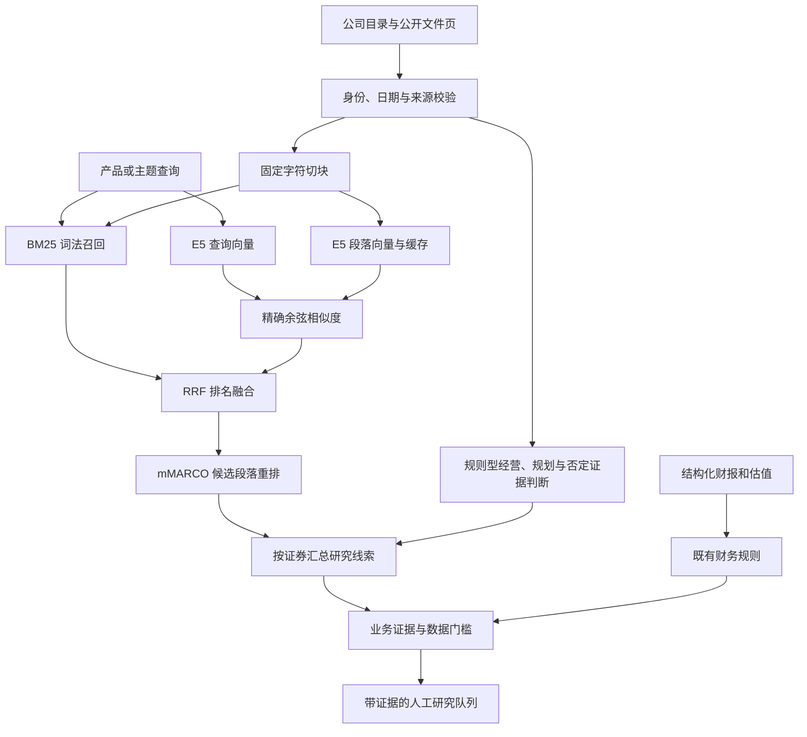

# 基本面公司发现算法：实现、复现与实验边界

本版本把产品或主题查询映射到公开文件中的相关段落，再汇总为可追溯的公司研究线索。新增多语言向量召回、排名融合与交叉编码器重排，用于检验中文、英文及语义改写能否改善公司发现。它仍是**算法实验版本**：输出固定标记 `production_approved=false`，没有证明生产适用性、投资收益或全市场筛选准确率。

实测结果及错误分析见本文第 10 节。模型的使用方式与输入约定分别参考 [E5 官方模型说明](https://huggingface.co/intfloat/multilingual-e5-small) 和 [mMARCO 官方模型说明](https://huggingface.co/cross-encoder/mmarco-mMiniLMv2-L12-H384-v1)。

## 1. 实际模块如何连接

| 模块 | 当前职责 | 主要接口 |
| --- | --- | --- |
| `ingest_theme.py` | 下载或读取明确列出的公开原文，验证 SHA256，按 PDF 页提取文本，生成导入审计与完整标记 | `ingest_manifest(...)` |
| `neural_models.py` | 显式下载固定版本模型；离线执行 E5 编码及 mMARCO 重排；记录运行环境、模型哈希和截断统计 | `download_models(...)`、`ModelBundle` |
| `semantic_retrieval.py` | 时间可见性与证券身份校验、固定切块、BM25、精确向量检索、RRF、重排、公司聚合及业务证据关联 | `build_chunks(...)`、`RetrievalIndex.search(...)`、`company_report(...)` |
| `semantic_discover.py` | 读取输入快照，调用公司发现，接入既有财务规则与数据门槛，导出结果并校验完整性 | `run(...)`、`verify_output(...)` |
| `theme_search.py` | 原词法检索、主题词典与规则型业务证据判断；也是独立比较的旧基线 | `discover_companies(...)` |
| `theme_financials.py` / `engine.py` | 基于结构化财报和估值计算财务指标与研究风格 | `attach_fundamentals(...)`、`screen(...)` |
| `readiness.py` | 检查声明股票池的覆盖率、时效、冲突及当前主题的经营证据 | `apply_theme_business_policy(...)`、`assess_readiness(...)` |
| `validation/semantic_eval.py` | 在冻结标签上计算不完整标注条件下的指标与区间，按意图组汇总 | `evaluate(...)`、`validate_corpus_alignment(...)` |



日常更新入口仍使用既有词法链路。神经检索通过 `semantic_discover.py` 显式运行，尚未自动替换每日任务中的默认算法。

## 2. 先校验来源，再建立固定语料块

`build_chunks` 先复用公司与文件校验逻辑，按 `as_of` 排除尚不可见的公司或材料，记录拒绝项、身份冲突及重复来源。只有被接受的文件进入索引。`observed_at` 表示观察到网页的日期，不会被解释为可回溯的历史公告日。

默认切块参数为 **480 个 Python 字符、相邻块重叠 80 个字符**，步长为 400。每页单独切分，最后一块可以较短；不跨 PDF 页、不随查询改变边界，也不生成替代原文。字符数与 tokenizer 的 token 数不同。

每个块保存：

- `document_id`、`ticker`、`source_url`、`source_type`、`page`、`available_at`、`date_basis`。
- 源文件提供的 `source_sha256` 以及可选标题。
- `char_start`、`char_end` 和原样截取的 `exact_excerpt`。区间是所属页文本中的零基、左闭右开字符位置，应满足 `page_text[char_start:char_end] == exact_excerpt`。
- 由上述块内容计算的 `chunk_id`；语料、证券目录、时点及切块配置共同构成 `corpus_sha256`。

固定窗口可能切开句子或表格；重叠能减轻边界问题，但不能保证语义完整。它也不解决扫描件 OCR 或财务表格结构恢复。来源哈希证明文件字节一致，不证明披露内容本身正确。

## 3. 五种比较方法各自在算什么

| 方法名 | 实际执行路径 | 公司分数含义 |
| --- | --- | --- |
| `legacy_bm25` | 原 `theme_search.discover_companies`：查询相关片段、主题词展开、BM25 与业务关系规则权重 | 最大加权片段分数 |
| `fixed_bm25` | 固定窗口与倒排索引上的 BM25 | 返回片段中的最高 BM25 分数 |
| `dense` | E5 查询与段落向量的精确余弦相似度 | 返回片段中的最高余弦分数 |
| `hybrid` | BM25 与 dense 各取候选，使用 RRF 融合排名 | 返回片段中的最高 RRF 分数 |
| `hybrid_rerank` | RRF 候选再经 mMARCO cross-encoder 重排 | 返回片段中的最高原始 logit |

`legacy_bm25` 的切段和规则权重与新链路不同，不能把它与新方法的差异全部归因于是否使用向量模型。`fixed_bm25` 才是固定语料块下的词法对照。

### BM25：关键词覆盖与词频归一化

新词法索引复用主题词典展开和文本规范化。英文使用词项，中文连续字符使用二元组；同一证券的相同规范化块文本只作为一个词法计分单元，保留其对应的不同日期证据。

令 `N` 为词法单元数、`df(t)` 为包含词项 `t` 的单元数，当前实现为：

```text
idf(t) = ln(1 + (N - df(t) + 0.5) / (df(t) + 0.5))
BM25(q,d) = Σ idf(t) × tf(t,d) × (k1 + 1)
                 / [tf(t,d) + k1 × (1 - b + b × len(d)/avg_len)]
k1 = 1.5；b = 0.75
```

查询展开后的 token 按集合使用，不因查询重复同一词而反复增加权重。没有匹配词项的块不会获得正 BM25 候选分数。

### E5：384 维语义表示与精确余弦检索

编码器固定为 `intfloat/multilingual-e5-small`，仓库 revision 为 `614241f622f53c4eeff9890bdc4f31cfecc418b3`，使用其固定的量化 ONNX 文件 `onnx/model_qint8_avx512_vnni.onnx`。具体文件字节数与 SHA256 固定在 `neural_models.MODEL_SPECS`。本项目使用本地 ONNX Runtime 的 CPU 执行器；文件名中的量化预设不等于项目会加载单独的 AVX512 原生程序。

查询输入加 `query: ` 前缀，段落输入加 `passage: ` 前缀。模型输出形状须为 `(batch, tokens, 384)`。对 attention mask 标记的非 padding token 做均值池化（attention-masked mean pooling），再做 L2 归一化：

```text
p = Σ(mask_i × hidden_i) / Σ(mask_i)
v = p / ||p||₂
similarity(query, passage) = v_query · v_passage
```

归一化后点积就是余弦相似度。当前索引将全部段落向量存为 `float32`，用 NumPy 矩阵乘向量计算相似度；**没有 FAISS，也没有近似最近邻索引**。这是一种可核对的精确检索基线，不能据此宣称已解决全市场海量文件的内存或延迟问题。

tokenizer 最多接收 512 tokens，右侧截断；默认模型 batch size 为 8。编码器和重排器分别记录输入数、批次数、截断输入数及截断后 token 数。480 字符窗口不能替代 token 截断审计。

### RRF：融合排名而非直接相加异尺度分数

融合常数默认 `k=60`：

```text
RRF(chunk) = Σ 1 / (60 + rank_in_list(chunk))
```

某个块未出现在某一路候选列表时，该路贡献为零。BM25 与余弦的数值尺度不同，RRF 只利用各自排名。相同分数按 `chunk_id` 稳定排序。

默认 `candidate_k=100`：BM25、dense 各最多保留 100 个块，RRF 再从联合候选中保留最多 100 个块。这里限制的是**块数**，不是公司数；一家公司的多个高分块可能占据候选预算。

### mMARCO cross-encoder：逐对阅读后重排

重排器固定为 `cross-encoder/mmarco-mMiniLMv2-L12-H384-v1`，revision 为 `1427fd652930e4ba29e8149678df786c240d8825`，使用 `onnx/model_quint8_avx2.onnx`。输入是未添加 E5 前缀的 `(query, passage)` 成对文本，由模型联合编码；成对输入合计仍受 512-token 上限限制，采用 `longest_first` 截断。

输出必须为 `(batch, 1)`。代码直接使用 **raw logits** 排序，没有 sigmoid、概率校准或业务置信度阈值。logit 可以为负；它不是“公司从事该业务的概率”，也不能与 BM25 分数、余弦值直接跨方法比较大小。

默认 `rerank_k=50`：只对 RRF 前 50 个块运行重排，最终候选来自这 50 个块。因此默认的 `hybrid` 与 `hybrid_rerank` 同时存在重排算法和候选数量两项差异。

### 产品型号与单位的当前限制

所有新检索方法在计分前共用 `_required_qualifiers`。查询中同时含字母和数字的连续词，例如 `800G`、`1.6T`、`NF8260G7`，会成为块级字面限定；要求这些限定在同一个块内出现。

该逻辑目前也会把 `800-gigabit`、`1.6-terabit` 当作字面限定，**尚未把它们规范化为 `800G`、`1.6T`**。因此，某些英文语义改写可能在向量召回之前就得到 `eligible_chunks=0`。这类失败应归因于当前查询约束处理，不能单独用来判断 E5 的语义表示能力。实验报告保留 `required_qualifiers`、`eligible_chunks` 和实际召回块数，方便分开检查。当前冻结实验不修改此规则或标签。

## 4. 检索命中如何变成公司研究线索

块按 `ticker` 聚合，公司分数取返回块中的最大分数，不把重复提及相加。公司排序按分数降序、ticker 稳定打破并列。公司输出最多显示 5 条 `retrieval_evidence`，同时记录总条数与截断标记；检索范围和候选预算仍可能使某家公司完全未返回。长年报或多重叠块可能挤占片段候选，取最大值只能避免重复加分，无法恢复已被候选截断的其他公司。

`company_report` 另外运行既有 `theme_search` 证据逻辑，关联正面经营证据、规划阶段和否定证据。语义分数本身没有晋升业务状态的权限：

| 情况 | 输出处理 |
| --- | --- |
| 既有证据规则支持经营业务 | 沿用 `current_business`，同时保留规则依据；仍需人工核实 |
| 只有规划或开发阶段证据 | `planned_business` |
| 仅语义相似，缺乏查询对应的经营证据 | `semantic_only=true`、`uncertain`、`requires_review=true` |
| 明确公司级否定，或经营与否定证据有无法消解的时序冲突 | `historical_or_disputed`，保留 `counter_evidence` |

否定规则区分局部产品与公司整体业务：某型号尚未推出不应抹去全部业务；“尚未量产”通常属于开发阶段；第三方业务、工商登记范围、客户介绍和行业背景也不能自动成为发行人自身经营证明。公司级正反断言只有在日期都是可比较的正式披露日时，才按先后关系判断；观察日期与正式披露日混用时保守留待核查。

这些仍是词法和规则判断，**没有训练 BERT 业务分类器**。通用神经模型也可能把否定句、同行描述或关联方介绍排在前列，因此高分命中不构成业务核验通过。

## 5. 财务筛选保持独立

`semantic_discover.run` 在检索结果上调用原有 `attach_fundamentals`，财务阈值、报表可见时间、会计口径、身份一致性和估值同业比较继续由 `theme_financials.py` / `engine.py` 处理。没有把语义分数加入 ROE、现金流、增长率或估值计算，也没有训练收益预测模型。

研究风格继续是 `quality_growth`、`relative_value`、`operating_improvement`；有已披露亏损的公司可以留在 `loss_watchlist`。缺财报不填零、不根据文章补造指标，结果保留 `unclassified` 或相应数据复核状态。相对估值使用全部输入中符合条件的同市场、同行业公司，不仅使用主题命中的前几家公司。

如果当前主题经营关系尚未成立，财务阈值即使满足，盈利类风格也会被暂缓显示；原始指标与 `financial_style_candidates` 保留供审核。显式提供 `--production-policy` 后，`readiness.py` 进一步检查主题经营证据的年龄、来源哈希、页码及原文 offset。近期无关公告不能替代当前主题的经营证据。

数据门槛通过只会形成 `data_gates_passed`，不会把算法实验自动认定为生产验收。未给 policy 时为 `not_assessed`；整个神经检索导出仍标记 `release_status=experimental_review_queue`、`production_approved=false`。

## 6. 缓存、版本和完整性审计

模型下载与查询是分开的显式操作。只有 `neural_models.py download` 联网；推理从本地完整模型包读取，缺少文件、哈希不符或运行中发生变化时失败，不自动改用另一模型或下载新权重。下载对每个文件核验固定大小与 SHA256，并在全部成功后写 `bundle.json`。限时、允许重试的 HTTP 状态和尝试次数由代码固定。

模型指纹包含模型 revision、所有文件哈希、模型适配代码 SHA256、Python/系统信息、NumPy/ONNX Runtime/tokenizers 版本、CPU provider、线程、batch、tokenization、池化及归一化参数。首次核验模型字节，运行期间继续核对文件身份变化。

向量缓存键包含 `corpus_sha256`、模型完整指纹与 `semantic_retrieval.py` 的代码 SHA256。同一文本在一次编码中只计算一次，再映射回来源块。持久化文件为 `vectors.npy` 与 `complete.json`：读取时检查哈希、dtype、维度、有限值及归一化，并禁用 NumPy pickle。出现损坏或不完整缓存时明确失败；需要保留现场并改用新的缓存目录重新构建。

当前缓存按完整语料版本管理，新增公告或改变截止日会形成新版本，尚未实现跨版本按新增文本增量编码。每日生产接入前，需要实现并验证增量策略，同时保留历史可见性与源文件追溯。

查询结果导出为：

- `results.json`：可见公司、完整公司集合、检索及业务证据、财务结果、数据门槛与运行统计。
- `manifest.json`：输入、代码、模型、参数与语料指纹，关联 `run_id`。
- `matches.csv`：精简的公司审核列表。
- `complete.json`：同一次导出的文件哈希与完成标记。

写入使用目录锁和原子替换；输入与代码在运行末尾再次核对。`--verify` 校验文件哈希、run id、完整与展示集合及 CSV 对应关系。这些措施用于复核与防止混合输出，不能代替数据事实审核或投资团队验收。

## 7. Windows 本地安装、下载与离线查询

以下 PowerShell 命令在仓库根目录执行。示例使用 Python 3.12；本地实验环境为 Python 3.12.14。虚拟环境不需要激活，也不需要修改 PowerShell 的脚本执行策略。

```powershell
py -3.12 -m venv .venv-semantic
$AlgoPython = Join-Path $PWD '.venv-semantic\Scripts\python.exe'
& $AlgoPython -m pip install -r requirements-semantic.txt
```

`requirements-semantic.txt` 当前固定 `numpy==2.2.6`、`onnxruntime==1.23.2`、`tokenizers==0.22.2`。本实现不需要 PyTorch、sentence-transformers 或 GPU。安装依赖本身会使用包源网络。

首次显式下载两套模型及 tokenizer/config，随后离线验证：

```powershell
& $AlgoPython neural_models.py download --cache-dir output/models
& $AlgoPython neural_models.py verify --cache-dir output/models
```

固定 revision 的文件无法下载或校验失败时，应保留失败信息；不要关闭 TLS 校验或去掉哈希要求。即使只运行 dense，当前 `ModelBundle` 也要求完整的两模型包通过核验。

使用仓库已有的短摘录进行接口试跑：

```powershell
& $AlgoPython semantic_discover.py --companies data/theme_companies.json --documents data/theme_documents.jsonl --query "机器人" --as-of 2026-10-10 --method hybrid_rerank --models output/models --cache output/semantic_vectors --output output/semantic_query_demo --candidate-k 100 --rerank-k 50 --threads 2
& $AlgoPython semantic_discover.py --verify output/semantic_query_demo
```

这里是 9 家公司的已选摘录，适合检查接口和证据导出，不代表全文实验或真实股票池。命令没有传财报与估值，不能据输出生成已通过财务筛选的名单。实际接入时通过 `--statements`、`--valuations`、`--production-policy` 提供独立审核的数据与门槛。

`fixed_bm25` 可不提供 `--models`。查询阶段即使本机有网络也不会主动下载模型。CLI 返回 0 表示本次计算与导出成功，返回 3 表示声明的数据门槛阻断，返回 2 表示运行错误；0 不代表生产验收。

## 8. 全文基准如何重建和复现

冻结基准使用 6 份 PDF 的 **669 页**，加 3 家没有 PDF 的公司网页短摘录，共 **672 条检索文档**。这三份网页材料是选定摘录，不是全站抓取。PDF 原文与生成的全文 JSONL 放在 ignored 目录，Git 克隆不会自带这些文件。

需要的文件关系如下：

| 文件 | 用途 |
| --- | --- |
| `data/theme_ingest_manifest.json` | 6 份 PDF 的证券、日期、正式 URL、固定源 SHA256 与本地路径 |
| `validation/raw/theme/` | 本地原始 PDF 快照；可由已验证缓存或允许的显式下载补充 |
| `output/theme_full_documents.jsonl` | 逐页提取的 669 条文件记录；冻结数据集要求其字节哈希匹配 |
| `data/theme_documents.jsonl` | 9 条原有短摘录；实验只补入没有 PDF 的 3 家 |
| `data/theme_sources.json` | 来源和既有开发语料元数据 |
| `validation/semantic_dataset.json` | 冻结查询、证券级判断、来源引用和三项语料输入 SHA256 |

PDF 提取另需 `pypdf`，没有包含在 `requirements-semantic.txt` 中。下面是**新工作副本中**的重建入口；已有实验正在运行时不要覆盖其输入文件。

```powershell
& $AlgoPython -m pip install pypdf==6.10.0
& $AlgoPython ingest_theme.py --manifest data/theme_ingest_manifest.json --output output/theme_full_documents.jsonl --cache-dir output/theme_source_cache --download
```

有匹配的本地原文或已验证缓存时，可去掉 `--download`。本地文件存在时会使用并核对它；缺少本地文件时，显式下载仍须符合清单中的原始 SHA256。发布方替换同一 URL 的文件后，即使链接仍有效也可能无法重建旧快照，这是应保留的失败。

重建不只要求页数相同：不同 PDF 提取器版本、源文件更新或文本序列化变化可能改变全文 JSONL 哈希。实验脚本会检查冻结数据集中的三项输入 SHA256；不一致就停止。不要为了跑通实验修改冻结标签的哈希或静默换用新文件。应恢复原验证快照，或另立有明确版本与重新审核流程的新基准。

来源对齐还会把六家 PDF 的短摘录别名，按 `ticker + source_sha256 + page + source_url` 映射到全文中的真实页 ID，并检查已有引用原话确实位于该页。全量 PDF 文本不会复制进公开标签文件。

准备完成后运行默认流水线比较：

```powershell
& $AlgoPython validation/run_semantic_experiment.py --dataset validation/semantic_dataset.json --models output/models --cache output/semantic_vectors --output validation/output/semantic_default_pipeline.json --candidate-k 100 --rerank-k 50 --threads 2
```

这轮的 BM25/dense/hybrid 最多返回 100 块，重排只保留 50 块，应命名为**默认流水线比较**，不能宣称控制了重排之外的全部变量。

为减小候选预算差异，另做同预算实验：

```powershell
& $AlgoPython validation/run_semantic_experiment.py --dataset validation/semantic_dataset.json --models output/models --cache output/semantic_vectors --output validation/output/semantic_equal_budget.json --candidate-k 50 --rerank-k 50 --threads 2
```

第二轮关注 `fixed_bm25`、`dense`、`hybrid`、`hybrid_rerank` 的 50 块预算对照。脚本仍会报告 legacy，但 legacy 的原切段、过滤及规则权重须单独解释。相同块预算也不等于相同公司数，融合候选集合与重排模型的 token 截断仍需检查。

脚本只给检索器查询与语料，不将 `judgments` 输入模型。它记录冻结标签/语料/公司/代码/模型哈希、来源对齐、各查询排名、规格过滤审计、编码缓存状态与计时；运行中若这些输入变化则停止。中断时保留 `.partial`，部分结果不能当作完成报告。

初次全文向量编码、缓存命中与逐查询检索耗时应分开报告。新四种方法的逐查询计时仅覆盖 `index.search`，不包括 `company_report` 对全语料的业务及否定证据检查；legacy 则计整个 `discover_companies`。这些计时范围不同，不能据此宣称新链路端到端提速。当前 pure dense 路径也会执行一次 `_bm25`，但该词法分数不参与 dense 最终排序。单机计时还受 CPU、线程、缓存和执行次序影响，不是生产延迟 SLA。

单元测试入口：

```powershell
& $AlgoPython -m unittest tests.test_semantic_eval tests.test_semantic_retrieval tests.test_neural_models tests.test_semantic_review -v
```

测试通过说明被覆盖的实现约束成立，不证明检索模型适合投资研究。

## 9. 标签和指标应怎样解读

冻结标签 SHA256：

```text
1231a1c29dd61304e52e67057a780e69826348cd23cb1fd5cfc8bdcadadb85b4
```

数据集有 **30 条查询、10 个不同意图组、9 家公司、23 个组级证券判断**。同一意图的精确表达、中文改写和英文改写共享标签，因此不能把 30 条表述称作 30 个独立研究主题。覆盖光模块及速率限定、机器人经营/规划/家庭应用/控制部件、AI 服务器及 CPU 数量限定。

全部标签为 `assistant_annotated`、`development_not_human_accepted`。使用原有开发语料，存在主题选择偏差，且旧开发检索结果曾在定位材料时可见；**没有独立盲测或独立留出集**。标签在本轮新模型运行前冻结，不能按跑分结果调整。

相关性分为 2（直接支持意图及限定）、1（相关但证据只支持早期规划/开发）、0（原文明确与限定冲突）。缺少证据的公司不标 0。例如公开材料列出到 800G 的产品，不能据此推断该公司没有 1.6T；它在后一个意图中保持 `unjudged`。

标签描述引用材料在披露或观察时的证据，不代表这些公司在统一历史时点或今日的完整业务事实。不同日期文件构成的研究语料不能直接充当无前视偏差的收益回测数据。

`evaluate(dataset, runs, k_values=(1,3,5))` 接收：

```text
runs[method][query_id] = [{ticker, score, evidence...}, ...]
```

提交顺序就是排名；分数必须有限，重复证券、未知查询、缺失查询结果或池外证券会报错。允许显式评测方法子集，但会列出缺失方法；空结果需要为该查询提供空列表。

| 指标 | 当前计算与不确定性处理 |
| --- | --- |
| Precision@K | 分母为请求的 K；未返回位置无检索贡献。已返回但未标注的证券使精确率形成上下界 |
| Recall@K | 分母考虑声明候选池中所有相关证券的可能数量；不是自动把未标注公司排除后的召回率 |
| `judged_positive_recall` | 仅对已知正例计算的诊断指标，不能冒充全市场或完整候选池召回率 |
| NDCG@K | 增益 `2^grade-1`，位置折扣 `log2(rank+1)`；对未知等级给保守区间，区间可能较宽 |
| MRR | 整个提交列表中首个相关证券的倒数排名；未知项仍占原位置，可能产生区间 |
| `judged_coverage` | 实际已返回项中有标签的比例；空结果为 null，另报实际返回数量与返回覆盖率 |

每个不确定指标输出 `{value, lower, upper}`；无法确定点值时 `value=null`。先平均同意图的查询变体，再对意图组等权宏平均；不会跳过 null 后只平均容易的查询。没有已知正例时的部分指标区间附带“存在至少一个相关候选”的条件；全池明确无相关项时，相应召回、NDCG、MRR 未定义。

这些指标只能评价有限语料中的研究检索。后续人工验收还需要扩大独立标签覆盖，复核否定与第三方归属、型号单位、多语言改写、文档时效，以及跨行业/跨时间的外部样本。

## 10. 实测结果与错误分析

2026-10-10 在本机 Windows、Python 3.12.14、CPU 两推理线程下实际运行两套预训练模型。数据为 672 条文档、2,083 个固定块、30 条查询。标签在运行前冻结，结果没有反向修改标签。所有指标均属于开发集诊断。

### 默认流水线：100 个候选块、50 个重排块

完整报告：[semantic_default_results.json](validation/semantic_default_results.json)。下表先按每个意图的三个表述平均，再对十个意图等权平均。区间是**未标注相关性的不确定范围**，不是抽样置信区间。已知正例召回只考察已标正例，不能称为完整召回率或准确率。

| 方法 | 已知正例 Recall@3 | Precision@3 区间 | NDCG@3 区间 | MRR 区间 |
| --- | ---: | --- | --- | --- |
| 原检索 legacy | 49.17% | 0.322–0.422 | 0.304–0.502 | 0.450–0.500 |
| 固定块 BM25 | 65.56% | 0.400–0.822 | 0.418–0.903 | 0.772–0.933 |
| E5 dense | 72.78% | 0.444–0.811 | 0.444–0.896 | 0.772–0.900 |
| RRF hybrid | 66.94% | 0.411–0.778 | 0.432–0.884 | 0.800–0.900 |
| hybrid + reranker | 70.56% | 0.444–0.711 | 0.459–0.849 | 0.817–0.883 |

纯向量的已知正例召回高于当前重排流水线；没有证据表明组件越多就越好。固定块 BM25 本身相对旧检索已有改善，因此不能把全部提升归功于神经网络。未标注较多、候选预算不同，尚不能据此选出可生产部署的最优方法。

### 同预算对照：各保留 50 个块

完整报告：[semantic_equal_budget_results.json](validation/semantic_equal_budget_results.json)。四种新方法的块预算均为 50；legacy 保留原流程，单列作参考。

| 方法 | 已知正例 Recall@3 | Precision@3 区间 | NDCG@3 区间 | MRR 区间 |
| --- | ---: | --- | --- | --- |
| 原检索 legacy（参考） | 49.17% | 0.322–0.422 | 0.304–0.502 | 0.450–0.500 |
| 固定块 BM25 | 63.89% | 0.389–0.789 | 0.411–0.893 | 0.761–0.933 |
| E5 dense | 66.94% | 0.411–0.733 | 0.422–0.862 | 0.756–0.900 |
| RRF hybrid | 68.06% | 0.422–0.778 | 0.446–0.881 | 0.806–0.900 |
| hybrid + reranker | 78.61% | 0.511–0.756 | 0.500–0.868 | 0.844–0.900 |

在这份开发集和相同块预算下，重排相对固定 BM25 的已知正例 Recall@3 高 **14.72 个百分点**，相对仅融合高 **10.56 个百分点**。这说明当前候选条件下有可测的排序改善，但不代表全市场准确率、收益或已通过生产验收。两轮对预算的敏感性也说明，不能只汇报最有利的一组参数。

两轮的标签、公司文件、语料、模型和检索/评测模块哈希完全一致；唯一变化的实验运行器补丁是输出覆盖保护与排他锁，不改变评分或标签。两份报告分别保留实际执行的代码指纹。公司文件哈希为 `f290f5d81b6cfff92d1318cc03fe177d00809ff4c6231f41581cbadf3d1fcbad`；该哈希在运行时记录，未预先纳入冻结标签的三项 `corpus_inputs`。

同预算整轮用时 **320.35 秒**，缓存校验/加载 **0.44 秒**；编码器仅处理 84 次查询输入，不再编码段落。重排 1,329 对，两个 tokenizer 均无截断。报告保留各查询和各意图的全部指标，包括普通 Recall@K 的上下界。遇到空返回时，已标注覆盖率按未定义处理，其意图宏平均也可为 null，不会剔除空查询后宣称更高覆盖率。

### 改写诊断与失败案例

默认流水线中，将共享标签的三类表达分别汇总，每类仍只有十个意图：

| 表达类型 | legacy | 固定 BM25 | dense | hybrid | rerank |
| --- | ---: | ---: | ---: | ---: | ---: |
| 基准表达及产品、否定、规划限定 | 87.50% | 89.17% | 85.83% | 85.83% | 85.83% |
| 中文语义改写 | 15.00% | 68.33% | 70.83% | 70.83% | 70.83% |
| 英文语义改写 | 45.00% | 39.17% | 61.67% | 44.17% | 55.00% |

以上都是已知正例 Recall@3。语义改写有改善，基准表达仍有退步；这不是独立留出集上的泛化结论。

- **改写召回改善**：查询“做自动执行动作的智能机器或正在研发这类产品的公司”，legacy 没有结果；固定 BM25 前三命中两个已知正例，dense 命中三个。该意图共四个已知正例，Recall@3 上限就是 75%。是否命中相关公司与所展示片段能否核实业务，还须分别审核。
- **重排的否定限定失败**：查询“已商业化的工业机器人供应商，不要只有研发规划的公司”，默认重排把冻结材料中仅有规划、标为 grade 0 的 `688585.SH` 排到第一，`002747.SZ` 降至第二。已知正例 Recall@3 仍是 100%，却掩盖了 Precision@1 和 MRR 的下降。检索排序错误不等于业务 gate 已放行该公司。
- **规格规范化失败**：`Companies offering 800-gigabit optical transceiver modules` 和对应 `1.6-terabit` 英文查询，因字面规格门槛导致 `eligible_chunks=0`，五种方法都没有结果。不能把这两次失败归因于向量模型。当前没有通过放宽规格限制来消除严格型号条件。

### 可复现性、耗时及完整链路

[语料重建核验](validation/semantic_rebuild_verification.json)确认：pypdf 6.10.0 从六份本地原文离线重建 669 页，与冻结全文逐字节一致，未发网络请求。部分原始 PDF 存在重复字典键警告，报告保留其数量；未导致此次文本和页数差异。

第一轮首次编码耗时 **786.69 秒**，完整五方法实验 **1,178.07 秒**。编码器输入共 2,167 次（包含重复的查询编码），重排输入 1,329 对，两种 tokenizer 在本轮均未截断。首次编码与查询延迟须分开解读。

第一轮新检索方法的 `index.search` 中位数分别约为固定 BM25 **0.0049 秒**、dense **0.0627 秒**、hybrid **0.0627 秒**、rerank **8.36 秒**。这些时间不包含完整公司核验链路；legacy 的 4.23 秒中位数包含其业务检查，不能直接做端到端提速比较。两条被规格门槛拒绝的查询也计入这 30 次观察，计时还受当时本机负载影响。

[真实 CLI 试跑](validation/semantic_cli_smoke.json)使用完整语料和真实模型，查询“AI 数据中心的算力服务器”：确认向量缓存命中，完整处理约 **21.69 秒**，输出四家公司并通过 `--verify`。浪潮信息位于首位，但所有公司仍是 `uncertain` / `unclassified`；它验证真实执行、证据和导出流程，不构成该查询的准确率评估。

### 业务规则与软件验证

[业务识别报告](validation/business_claim_results.json)将九条公开摘录与 36 个合成对抗案例分开统计。公开摘录的业务状态和断言类别各正确 **7/9**，macro-F1 各为 **0.611111**；优必选、联想两条仍误判为不确定。合成案例业务状态 **36/36** 正确，不能与公开摘录混为真实市场准确率。它们均为开发标签，尚无独立双人审核。

[最终软件验证](validation/semantic_software_results.json)在冻结代码下通过 **465 项测试，零失败、零错误、零跳过**；同时完成独立财务算术核对、搜索交叉校验和 1,000 家合成公司规模检查。新增测试覆盖池化/归一化、模型哈希、缓存损坏、时间隔离、全业务退出、未知标签指标区间、CSV 对账及防覆盖锁。合成规模检查不等于 1,000 家真实公司已接入。CI 另外在 Windows/Linux 与 Python 3.10/3.12 上运行；真实模型实验报告来自上述本机，不把替身单元测试称为模型效果评估。

### 进入生产前的剩余工作

需要由研究员审核并扩大标签，另设按公司和时间隔离的外部评测集；补足未标注候选、否定与主体归属样本；统一速率和型号表达且防止误放宽；检查长报告占据片段预算的偏差；校准拒答/低相关阈值及业务分类；完成增量编码、全市场资料覆盖、结构化财务数据与每日运行验收。此次未更换每日默认检索。

本实现使用冻结的预训练模型做推理，**没有微调、没有训练专门的 BERT 业务分类器、没有 FAISS、没有自动交易或收益保证**。它交付可运行、可复验的算法实验链，企业生产适用性仍待上述验证。
