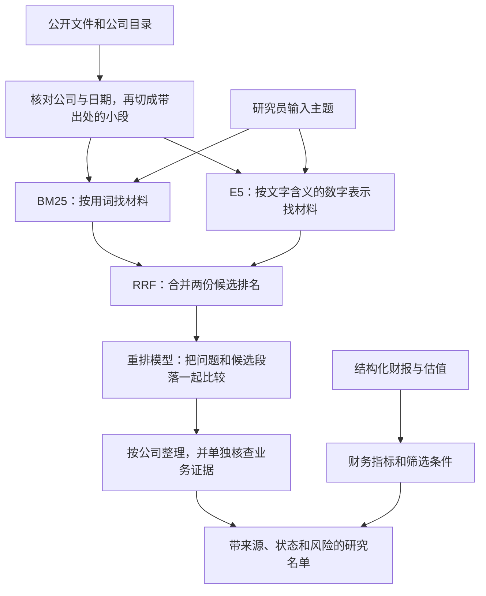

# 用大白话看懂 chenxi-algo：目标、模型和完整流程

这份文档先讲项目要解决的工作问题，再解释每个模块为什么存在。代码、公式和复现实验放在 [技术文档](ALGORITHM_EXPERIMENTS.md)；这里用例子把它们串起来。

## 1. 项目到底要帮研究团队做什么

研究员输入一个产品或主题，例如“机器人”“光模块”“AI 服务器”，程序从已经收集的公开资料里，找出可能相关的 A 股、港股科技与制造公司，并把支持这个判断的原文、页码、日期和链接一起交出来。

接着，程序检查材料讲的是已经开展的业务、研发规划，还是已经退出的业务；有可用的财报和估值时，再按基本面条件整理研究名单。

最终交付物是一份**可以回到原文核查的公司研究清单**。它要减少的是研究员找材料、找相关公司、核对重复信息和整理初筛表的时间。投资判断仍需结合竞争格局、商业模式、估值假设等研究工作。

一个候选公司需要分别回答三个问题：

| 问题 | 主要由谁处理 | 结果意味着什么 |
| --- | --- | --- |
| 哪些材料可能和我研究的主题有关？ | BM25、E5、RRF、重排模型 | 决定优先看哪些材料 |
| 材料能否支持这家公司正在做这项业务？ | 业务证据规则，加研究员复核 | 区分当前经营、规划、冲突和待核验 |
| 财务上是否满足这类研究名单的条件？ | 财务计算与规则模块 | 在数据充分时，分到相应基本面风格 |

例如，一家公司关于机器人的公告很多，但可能只是准备进入这个行业；另一家公司确实在销售机器人，却可能亏损。检索、业务核验和财务筛选各自回答不同的问题。

**当前进度：语义模型链已经能在本机运行并有实验记录。** 每日任务仍使用既有词法检索，新模型需要显式运行 `semantic_discover.py`。全 A/H 数据覆盖、每日生产接入和研究团队验收仍未完成。

## 2. 把它想成一次有分工的资料检索

假设你有一柜子年报、公告和产品介绍，要找“已经销售工业机器人的公司”。整个流程可以这样理解：



图中的“按词找”和“按含义找”是两条并行路线。RRF 把它们合并，重排模型再处理其中一小批候选。

这里真正加载了两套预训练神经网络：**E5 编码器**和 **mMARCO MiniLM 重排器**。BM25、RRF、业务规则和财务规则也是算法，但不需要加载这类神经网络权重。

## 3. 先把文件整理成能搜索的材料

代码入口是 [ingest_theme.py](ingest_theme.py) 和 [semantic_retrieval.py](semantic_retrieval.py)。

PDF 提取工具先把每页可以读取的文字取出来；扫描图片中的文字还需要另外处理 OCR。程序保留证券标识、出处、物理页码和可用日期，排除截止日之后才出现的材料。

随后每页切成最长 **480 个字符**的小段，相邻段重复 **80 个字符**。可以想成把长材料做成卡片，卡片边缘留一些重复内容，减轻一句话刚好被切开的影响。它仍可能切开句子和表格，并不能保证每张卡片都语义完整。

每张卡片都记着自己来自哪一页、原文的哪个位置。程序交付的是可定位的原文，方便你核查上下文。

文件还会计算 SHA256，可以把它理解为用于核对文件字节的“指纹”：重新拿到一个文件，可以检查它是否和当时用的是同一个版本。这个指纹与下面的语义向量是两种不同的东西。

## 4. BM25：先用词找线索

代码在 [semantic_retrieval.py](semantic_retrieval.py) 的 `_bm25`。

BM25 的工作很直接：查询和材料出现了哪些相同词，这些词对区分材料有多大帮助。

例如你搜“工业机器人”，讲机器人产品的段落应该比只讲公司治理的段落更值得先看。BM25 会考虑：关键词出现几次、这个词是否几乎每份材料都有、段落是不是因为特别长才碰巧出现更多词。重复出现的作用会逐渐减弱，不会简单出现十次就加十分。

项目还做了主题词展开。中文会拆成相邻两个字的片段参与匹配，英文按词处理。因此，BM25 并不要求整句查询原封不动地出现在材料里。

它的优势是快、容易检查，遇到明确产品名时很有用。但你问“自动执行动作的智能机器”，材料写“机器人”，单靠相同用词可能找不全。E5 用来补充这类线索。

## 5. E5：把一段话变成可以比较的数字

实际模型是 `intfloat/multilingual-e5-small`，代码在 [neural_models.py](neural_models.py) 的 `ModelBundle.encode`。

### “文字变成向量”具体是什么意思

向量在这里就是一串数字。E5 把一条查询或一个材料片段，处理成 **384 个数**，例如：

```text
一段文字 → [0.12, -0.08, ……一共 384 个数]
```

这些数字只是示意，不是某家公司实际输出。384 是模型固定的输出长度；不能把第 1 个数理解为机器人业务、第 2 个数理解为利润质量。它们是模型在训练中形成的联合表示。

可以借用地图来理解：地图用坐标表示地点；模型用这组数字表示文本。我们希望查询与相关材料的表示更接近，方便把候选找出来。这个类比只解释检索方式，不能保证模型每次都判断正确。

### 这组数字怎样得到

项目里的处理顺序是：

1. **拆成 token。** token 是模型使用的小片段，可能是字、词或词的一部分；它和中文字符数不是一回事。
2. **让编码器处理上下文。** 每个片段的表示会结合周围内容，而不是只查一个固定词典。
3. **把片段表示汇总。** 程序对有效 token 的输出取平均，得到整段文字的 384 个数；为凑齐批次长度添加的空位不参加平均。
4. **统一向量长度。** 把这组数缩放到统一长度，方便后续比较方向。这一步叫 L2 归一化。

当前模型输入最多保留 512 个 token，超长会截断并记录；前面的“480 字符切块”和这里的“512 tokens”使用不同计数单位。

然后计算查询与各材料的**余弦相似度**。在归一化之后，就是把对应位置的数字相乘再相加。项目用 NumPy 逐一比较语料向量，尚未接入 FAISS 等近似检索工具。

相似度用于排序。例如 `0.8` 不能读成“80% 确定这家公司做这项业务”。分数还会受模型、用词、上下文和材料切分影响。

### 它为什么可能找到不同说法

E5 的发布者已经用大量文本对训练模型，让适合匹配的文本表示更接近。比如“机器人”和“自动执行任务的机器”用词不同，向量路线可能仍找到相关材料；具体能找到多少，要在我们的语料上实测。查询和材料分别加 `query: `、`passage: ` 前缀，以符合模型的输入约定。[E5 官方说明](https://huggingface.co/intfloat/multilingual-e5-small/blob/614241f622f53c4eeff9890bdc4f31cfecc418b3/README.md)

材料向量可以先算好保存。以后换一个查询，在语料和配置未变的情况下，只需要编码新查询，再与已有向量比较。不过，目前缓存按完整语料版本管理，新增文件后还没有实现只补算新增片段的跨版本增量机制。

### 它与你熟悉的 BERT 有什么关系

你说的“用 BERT 把语义变成向量”，方向与这里相近。当前固定版本的 E5 配置确实声明 `BertModel`：它使用 BERT 类编码器结构，并已接受面向文本表示和检索的训练。项目还按它的约定做平均汇总和归一化。[固定版本配置](https://huggingface.co/intfloat/multilingual-e5-small/blob/614241f622f53c4eeff9890bdc4f31cfecc418b3/config.json)

**本项目调用已经训练好的 E5 权重，没有自行训练或微调一个金融 BERT。** 也不能认为随便取一个普通 BERT 的输出，就会获得与 E5 相同的检索效果。

## 6. RRF：合并两份意见，不直接把分数相加

代码在 [semantic_retrieval.py](semantic_retrieval.py) 的 `reciprocal_rank_fusion`。

BM25 给出一份候选排名，E5 给出另一份。两种分数的刻度不同，BM25 的 12 分不能与余弦相似度的 0.8 直接相加。RRF 因此主要看**名次**。

当前规则是：每一路贡献 `1 / (60 + 名次)`，同一片段在两路中的贡献相加。前面的片段贡献更高，同时被两路找中的片段可以得到两路支持；它并不要求必须被两路同时找到。

一个只为解释公式的例子：某片段只在一路排第 1，贡献约为 `0.0164`；另一个片段在两路都排第 2，合计约为 `0.0323`。后者会在这个例子中排得更靠前。这些数仍只决定检索顺序。

RRF 本身不读懂文字，也不是第三个神经网络。它把两种检索方法已经给出的排名组合起来。

## 7. mMARCO MiniLM 重排器：把问题和材料放在一起比较

实际模型是 `cross-encoder/mmarco-mMiniLMv2-L12-H384-v1`，代码在 [neural_models.py](neural_models.py) 的 `ModelBundle.rerank`。

长名字可以拆开看：`cross-encoder` 表示成对处理查询和材料；`mmarco` 指训练所用的多语言检索数据；`mMiniLMv2` 是基础模型系列；`L12` 表示 12 层；`H384` 表示内部每个 token 的隐藏表示长度为 384。重排接口最后给出的是一个分数，不会因此再建立一套段落向量库。

它与 E5 最重要的区别是输入方式：

| E5 召回 | Cross-Encoder 重排 |
| --- | --- |
| 查询和材料分别编码，再比较向量 | 查询与一个材料片段一起输入模型 |
| 材料向量可提前算好、反复使用 | 换一个问题，通常需要重新对候选逐对打分 |
| 适合先从较多材料里找候选 | 适合对一小批候选进一步调整顺序 |

例如，下面是教学用的虚构材料，不是实测输出：

```text
查询：找已经销售工业机器人的公司。
A：本公司已经向客户交付工业机器人。
B：本公司正在研发工业机器人，尚未交付。
```

两段都提到了工业机器人。我们希望重排器结合问题里的“已经销售”，把 A 放在 B 前面。Cross-Encoder 给了模型同时处理查询和材料的机会，但这种结构并不保证它能可靠理解每个否定条件。

本项目的重排器使用多语言 MiniLMv2 作为基础，并由发布者在 mMARCO 检索数据上训练。这里直接使用现成模型，输出一个原始相关性分数，再按分数排序。[模型官方说明](https://huggingface.co/cross-encoder/mmarco-mMiniLMv2-L12-H384-v1)

代码中这个分数叫 `logit`，可以为负。它尚未校准成概率，也不能代替“当前经营”“尚在规划”等业务结论。

为了控制计算量，默认两路各取最多 **100 个片段**，RRF 再选出最多 100 个，最后只重排前 **50 个片段**。这些数量都是片段数；一家长年报里的多个片段可能占据不少位置，不能理解成筛出了 50 家公司。

## 8. 为什么后面还需要业务核验和财务规则

因为“材料与主题相关”“公司正在开展业务”“公司财务满足条件”之间，没有自动成立的等号。

### 业务核验：这段话在说谁、说到了哪一步

[theme_search.py](theme_search.py) 的规则尝试区分：公司自身的产品、客户或同行的业务、行业背景、研发计划，以及停止或退出业务的公告。它还考虑正反材料的时间关系。

例如，“本公司生产机器人”与“本公司客户是机器人生产商”都可能被检索到，但不能给出相同的经营结论。较早的产品介绍与后来的退出公告发生冲突时，也需要保留反向证据。

只有语义检索线索、没有被既有词法证据链检索到的公司，会标记 `semantic_only=true`，通常是 `uncertain`，供研究员继续核查。如果找到了明确的公司级否定证据，则会标为 `historical_or_disputed`，并保留反向原文。若提供了生产准入配置，还会检查主题证据的时效；一条近期无关公告不能把旧业务材料变成新证据。

这一层目前以词法和规则为主，尚未训练专门的业务分类模型。规则也有识别不到或判断错误的情况，所以证据与状态要一起看。

### 财务筛选：用已经核对口径的数据计算

[engine.py](engine.py) 和 [theme_financials.py](theme_financials.py) 接收结构化财报和估值，计算 ROE、现金利润转换、增长、债务及估值等指标，再按配置分组。

| 名单 | 大白话含义 |
| --- | --- |
| 优质成长 | 盈利、现金流质量和增长等条件同时满足相应门槛 |
| 相对价值 | 在同市场、同行业可比公司中，满足估值和财务条件 |
| 经营改善 | 利润、利润率、经营现金流等出现规定数量的改善信号 |
| 亏损观察 | 披露的归母利润为负，仍保留线索和风险供研究 |
| 未分类／待核验 | 资料不足、条件未满足，或主题业务关系尚未成立；原因单独列出 |

具体条件见 [主题算法说明](THEME_ALGORITHM.md) 和 [配置](theme_config.json)。这些是可检查的研究规则，当前没有用股票未来收益训练这些门槛。语义相关性分数不会加入 ROE 或估值计算；E5 也不负责从 PDF 自动提取并核准整套财务报表。

公司即使满足财务条件，只要当前主题业务尚未成立，三个盈利研究风格也会暂缓显示。缺失财务数据会保留缺失状态，不能根据文章听起来不错就补出一个数。

## 9. 用一次真实运行把流程串起来

仓库留有一次真实模型试跑：[运行记录](validation/semantic_cli_smoke.json)。输入是：

> AI 数据中心的算力服务器

程序对已经接入的 669 页 PDF 和 3 条官网摘录检索，复用了此前保存的向量，经过融合和重排，输出了四家公司；浪潮信息排在第一。

随后，业务核验没有对这条查询建立足够的当前经营证明，输入也没有配套财务数据。因此，四家公司都保留为业务 `uncertain`、财务 `unclassified`。

这个结果的实际含义是：**先把可能值得查的公司和原文交给研究员，同时把尚未确认的部分明示出来。** 它既不能证明这四家都真正符合主题，也不能把第一名解释成可以买入或最有投资价值。

按公司汇总时，当前取该公司返回片段中的最高分，不把所有重复提及加起来。这样的做法减少了重复提及累加分数的问题，但长报告仍可能挤占前面的候选片段名额。

## 10. ONNX、训练、缓存分别是什么

| 名称 | 在本项目中怎么理解 |
| --- | --- |
| 训练 | 用样本调整模型内部的大量参数；E5 和重排器的发布者已经做过 |
| 推理 | 使用固定参数处理新文本；本机现在执行的是这一步 |
| 微调 | 在现有模型基础上，用领域样本继续训练；本项目尚未做 |
| ONNX | 保存模型计算过程的一种格式 |
| ONNX Runtime | 负责执行这种模型的运行程序；这里使用 CPU |
| 量化模型 | 用较低精度表示部分数值来减轻存储和计算负担；本项目选了发布者提供的固定量化版本 |
| 向量缓存 | 保存已经计算的段落向量，满足版本条件时直接复用 |
| 哈希校验 | 检查模型文件、输入和输出的字节是否与记录一致 |

模型文件先通过显式下载命令获取。之后本地推理不会自动联网更新材料或更换模型；资料采集是另一条流程。当前不需要 GPU，也没有在模型之后接一个聊天模型生成研报结论。

缓存会减少重复计算，但不能说明首次建库也同样快。此次 2,083 个片段首次编码约 13 分钟，另一次完整公司查询约 22 秒；都是特定本机负载下的观察，不能当作所有机器和语料规模的速度承诺。

## 11. 已经证明了什么，还没有证明什么

2026-10-10 的同候选预算实验中，各新方法最多保留 50 个片段。固定 BM25 的已知正例 Recall@3 为 **63.89%**，混合重排为 **78.61%**。[完整报告](validation/semantic_equal_budget_results.json)

这个指标可以这样理解：假设某个主题已有四家公司被标为相关，前三名找到其中两家，那么这条查询的已知正例召回就是 `2/4=50%`。实际报告先平均同一意图的几种表述，再平均不同意图。78.61% 不是“每推荐 100 家就有 79 家正确”，也不是投资成功率。

评测只有九家公司、十个不同意图、三十条查询，标签由助手整理，尚未经研究团队独立验收；没标注的公司保持未知。它支持在这份开发集上比较实现，不能证明全市场效果。

也有明确失败：

- 搜 `800-gigabit` 时，当前规格规则没有把它统一成 `800G`，在模型排序前就可能把候选全部挡掉。
- 一条要求排除“只有研发规划”的查询，默认重排反而把已标负例排到第一。模型能共同处理查询和材料，不等于它一定理解对了否定条件。
- 重排并非在所有候选预算下都最好。默认 100/50 配置中，纯向量的已知正例 Recall@3 高于混合重排。

详细比较见 [实验与失败分析](ALGORITHM_EXPERIMENTS.md)。465 项软件测试通过，说明对应实现和边界经过检查；研究相关性还需要更多独立标签与实际使用验证。

## 12. 从哪里开始读代码

建议按实际调用顺序读，先看输入和返回值，再看模型细节：

1. [semantic_discover.py](semantic_discover.py)：一条命令怎样串起检索、核验、财务分类和导出。
2. [semantic_retrieval.py](semantic_retrieval.py)：`build_chunks` 切材料，`search` 排片段，`company_report` 整理公司和证据。
3. [neural_models.py](neural_models.py)：`encode` 生成向量，`rerank` 为查询与片段打分。
4. [theme_search.py](theme_search.py)：当前业务、规划、否定和主体归属的规则。
5. [theme_financials.py](theme_financials.py)：如何把财务条件与业务状态一起用于研究名单。
6. [validation/semantic_eval.py](validation/semantic_eval.py)：如何比较检索结果，并保留未知标签带来的不确定性。

完整安装和运行命令见 [技术文档](ALGORITHM_EXPERIMENTS.md)，每日流程与生产缺口见 [PRODUCTION.md](PRODUCTION.md)。
